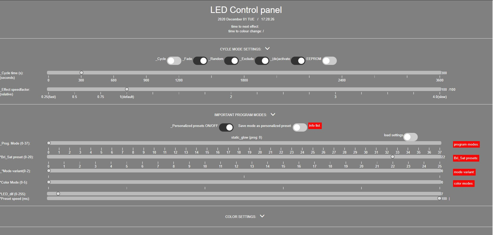

# xGlow
 Standalone LED firmware for esp8266 and esp32 based on the FastLED library. The code is quite amateurish; however, it works, it's stable, the effects are neat and once initialized (and personalized) you only have to power the LEDS and the ESP controller (I use a quinled DigUno), and it will run through all the selected presets (with all the desired parameters) for hours without getting bored.

 Summary:\
 -mainly producded for Christmas lighting: slow effects without too much black or flicker (strobe), always glowing, and ever changing colours\
 -37 presets (you can add more)\
 -web and OLED interface (web is based on websocktets) - OLED not necessary\
 -IR controlled (not necessary)\
 -Cycle options: random, fade, time to change preset, every preset can be excluded, etc.\
 -EEPROM/ SPIFFS\
 -Many, many options of which many can be saved to EEPROM\
 -once flashed and spiffs initialized, no IDE needed.\
 -And more

 Motivation:\
This project started in january 2019. I didn't know a single thing about programming, and had to learn the very basics such as what a byte actually means. Initially I flashed scripts from Mark Kriegsman (FastLED developer), but I got tired of doing so. I also had discovered the work of Stephen Culley and his presets are very very subtle and mesmerizing - go check out his youtube video! The only downside is that his code isn't made public (yet) and the firmware has/had no options to lower the brightness, so I started coding myself.

Future goals:\
The code is amateurish. I will probably update certain aspects: IR part is somewhat outdated (due the web interface), add relay support, add pre-compiled binaries (I can't yet succesfully flash the file system with the binaries I made), and I still would like to learn and make use of json, but other than these things I won't likely do much more. The code works, it suits my needs for christmas, it can do things other available firwmare can't, but I don't feel like adding all the options that WLED has for example. For other use than christmas lightning I'd highly recommend WLED. 

Thanks to:\
Developers from FastLED\
Stephen Culley\
and everyone who makes these libraries publicly available!

Layout with all tabs:

Main settings that basically allow you to control everything:

Color_settings tab. An example tab which allows the used to personalize settings.

