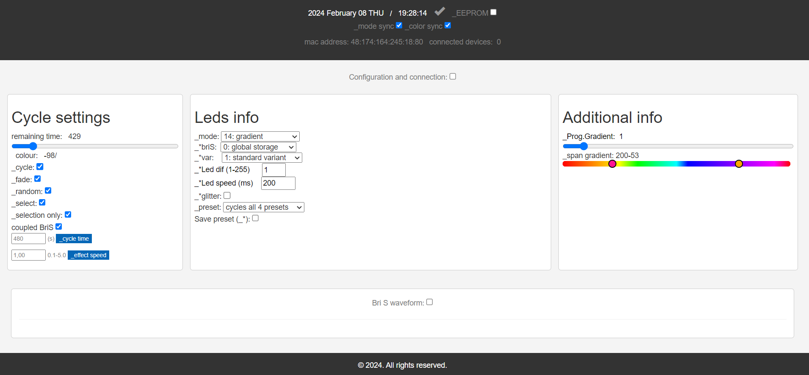
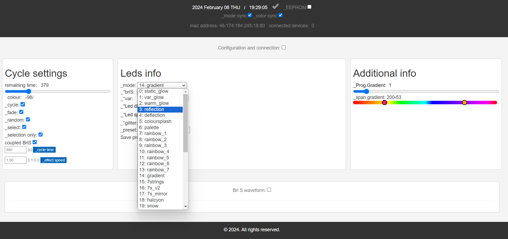
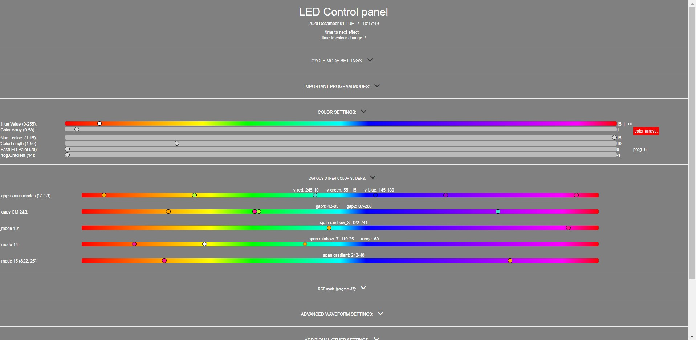

# xGlow
 Standalone LED firmware for ESP8266 and ESP32 boards build on the FastLED library - all ESP nodes can be synchronized via ESP-NOW. The code is quite amateurish, but it works, it's stable, the effects are very neat and once initialized (and personalized if you like) you only have to power the LEDS, and it will cycle through all the (selected) presets for hours without getting bored. I use Quindor's DigUno and DigQuad controllers.

 Summary:\
 -Produced for Christmas lighting: many glow effects, and ever changing colours\
 -38 modes\
 -4 presets per mode (thus a total of ~150 different amazing effects)\
 -A lot of options and presets can be personalized and saved to EEPROM\
 -webserver (websockets) and OLED interface (OLED isn't necessary)\
 -All ESP32 and ESP8266 nodes can be synchronized via ESP-NOW\
 -Cycle options: random, fade, time, and every preset can be excluded if disliked\
 -IR (not necessary)\
 -And more\

 Motivation:\
This project started in january 2019. Initially I flashed scripts from Mark Kriegsman (FastLED developer), but I got tired of doing so. I also had discovered the work of Stephen Culley and his are very subtle and mesmerizing effects (go check out his youtube video!). The only downside is that his code isn't made public (yet) and the firmware has/had no options to lower the brightness, so I started coding myself. I didn't know a single thing about programming, and had to learn the very basics.

Future goals:\
It does everything I want chrismas lighting to do, so no future plans for now. If you want to control LEDs via E1.31 or xLights, other projects like WLED or Espixelstick are advised.

Thanks to:\
Creators of the FastLED library\
Stephen Culley\
and everyone who makes these libraries publicly available!

Layout with all tabs:

Main settings that basically allow you to control everything important:

Modes:

Color_settings tab. An example tab which allows to personalize settings:

